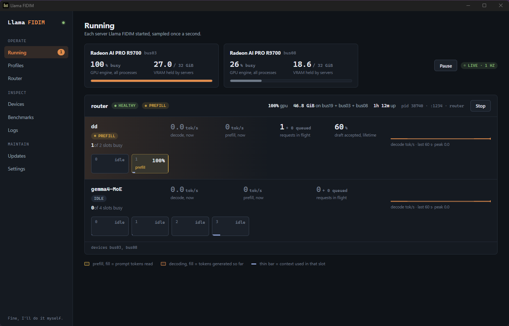
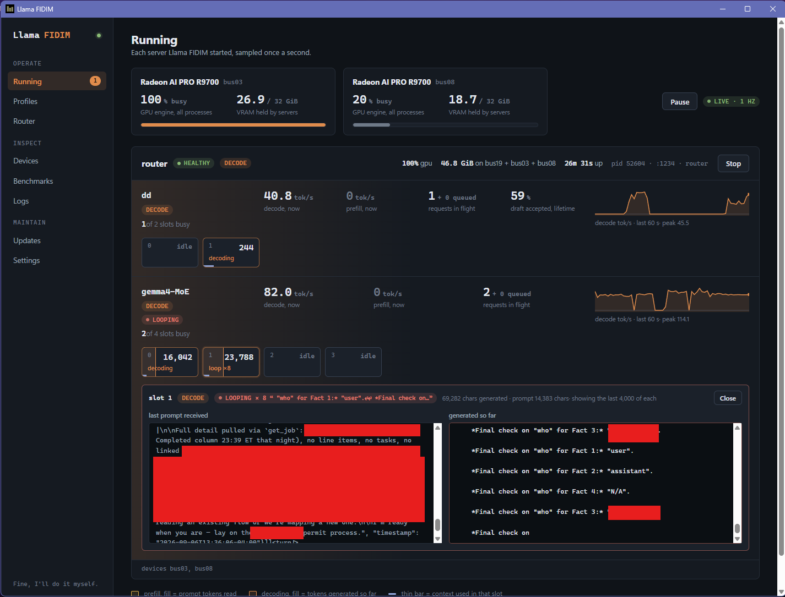

# Llama FIDIM

**Fine, I'll Do It Myself.** A desktop app and CLI that runs llama.cpp
servers on AMD graphics cards under Windows 11, and lets you decide the
things the popular launchers decide for you: which card a model lands on,
how a model splits across two cards, how many copies of one model run at
once, and which ROCm runtime each server uses.

It started because LM Studio would not let us choose where model layers
split, or run a second instance of a model we were already serving. So we
wrote the launcher we wanted.



## What it does

- **Profiles.** A profile is one saved launch: the model file, the
  llama.cpp build, the GPU placement, the context and batch settings, the
  sampler, and any extra flags. Every number with a range is a slider, every
  field has a hover hint, and the model author's published sampling defaults
  can be applied with one click.
- **GPU placement you control.** Put the whole model on one card, or split
  it across two by layer with the fraction you choose. Devices are bound by
  a stable hardware key, never by an index that changes when a driver
  updates.
- **Pre-flight before every launch.** Twelve checks run as you edit and
  again at launch: the build runs, the files exist, the estimated VRAM fits
  in the free VRAM of each card, the port is free, the alias is unique, the
  driver matches what you benchmarked on, and a few Windows-specific traps
  (a display on a compute card, the PCIe power setting that evicts VRAM on
  idle). Anything that would fail is blocked with a reason.
- **One port for every model.** Router mode puts every profile behind one
  OpenAI-compatible endpoint. Clients keep one base URL and pick a model by
  name; with autoload on, instances start on the first request that names
  them, and past the instance limit the least recently used one is unloaded.
- **Live view.** Each running server, sampled once a second: per-slot phase
  and progress, decode and prefill tokens per second, requests in flight,
  speculative-decoding acceptance, GPU busy and VRAM held per card. Turn on
  trace tokens in a profile and each slot also shows its last prompt and
  the text it is generating, with a detector for endless loops.

  
- **Updates that never touch a running server.** llama.cpp releases install
  side by side with a changelog of what changed since your build. ROCm
  runtimes install the same way from AMD's release and nightly channels,
  and a profile can pick any installed version. Promote profiles to a new
  build in one click, roll back in one click.
- **Benchmarks.** Serial and concurrent decode sweeps against a running
  server, stored per profile as its baseline.
- **Nearly everything the GUI does, the `fidim` CLI does too.** The live
  slot text and the profile editor are GUI only; profiles are plain JSON.

## Requirements

- Windows 11 with an AMD Radeon card that upstream's Windows ROCm build
  targets: RDNA4 (RX 9000, Radeon AI PRO R9700), RDNA3 (RX 7000, W7000),
  the RDNA3.5 APUs (Strix Point, Strix Halo) and RDNA2 (RX 6600 and up).
  Tested here on two Radeon AI PRO R9700s. The 780M-class APUs are not in
  that build. Windows 10 is untested.
- An AMD driver. The HIP SDK is optional: the app can install ROCm
  runtimes from AMD itself.
- To build from source: a Rust toolchain (stable, MSVC), Node 20 or newer
  with pnpm, and WebView2 (ships with Windows 11).

## Install

There are no binary releases yet. Build and install from the repo:

```
git clone https://github.com/Dixon-Cider/llama-fidim
cd llama-fidim
powershell -File scripts\install.ps1
```

The script checks for the build tools, builds the CLI and the GUI, installs
both under `%LOCALAPPDATA%\Programs\LlamaFIDIM`, and creates a Start Menu
entry. Add `-AddToPath` to make `fidim` available in every shell. Re-run it
after pulling changes.

## First run

1. Open **Settings** and add your model folder. If LM Studio is installed,
   its download folder is already there.
2. Open **Updates**. If no ROCm runtime is listed, install one from the ROCm
   section and press **Make default**. Then install the latest llama.cpp
   build; its verification needs a runtime to load the HIP backend.
3. Open **Profiles**, create one, pick a model and a card, and press
   **Save & load**. The Running tab shows it come up.

Everything lives under `~\.fidim`: `config.json`, `profiles\*.json`,
run state and logs under `runs\`, and the router preset. All of it is plain
JSON you can edit by hand.

## The CLI

```
fidim devices              fresh GPU enumeration: keys, VRAM, displays
fidim profiles             saved profiles with validation findings
fidim check <id>           run pre-flight without launching
fidim launch <id>          pre-flight, spawn detached, verify placement
fidim status [--deep]      what is running and whether it answers
fidim live                 slots, throughput and GPU busy, once
fidim bench <id>           serial + concurrent sweep, saved as baseline
fidim stop <id|port>       clean stop
fidim export <id>          a standalone .bat or .ps1 that runs without the tool
fidim router ...           configure, launch and manage the one-port router
fidim update [--install]   llama.cpp releases, changelog, install, promote, roll back
fidim rocm list|install    ROCm runtimes from AMD's channels
fidim runtimes             every runtime a profile can name
```

## Why some things are the way they are

These came from real failures on real hardware and are deliberate:

- **Devices bind by hardware key, not index.** ROCm's index order changes
  with driver updates and with which card has a monitor. A profile that
  said "device 1" would silently land on a different card.
- **Every standalone launch pins `HIP_VISIBLE_DEVICES`.** A server that sees
  every card can spill onto one you did not choose. The router cannot be
  pinned that way, since one process serves models on different cards, so
  each of its models gets an explicit `device` in the preset instead.
- **VRAM residency is read per process from Windows, not from
  `--list-devices`.** WDDM virtualises VRAM, so free-memory deltas cannot
  see other processes.
- **A display on a compute card is a warning.** Desktop compositing takes
  VRAM and pre-empts compute. And on the hardware we tested, the PCIe Link
  State Power Management power setting, when not Off, let Windows evict a
  whole model from VRAM while a card idled. Pre-flight checks both.
- **Runtime selection is real.** Each runtime gets its own shim folder for
  DLLs a build imports under a different name, so picking a runtime means
  that runtime, not whatever is in the exe folder.
- **Nothing on the Updates tab starts a server.** Installing, promoting and
  rolling back only change files and profiles.

## Layout

```
crates/fidim-core   discovery, GGUF headers, devices, VRAM estimate, pre-flight,
                    launch, supervision, router, live view, updates, ROCm runtimes
crates/fidim-cli    the fidim binary
ui/                 Tauri 2 + Svelte 5 desktop app
scripts/            install.ps1, build-from-tag.bat (source builds)
fixtures/           captured --list-devices / hipInfo / WMI output used by tests
```

```
cargo test          # set FIDIM_TEST_MODELS=<folder of .gguf> to also parse real files
```

## Name

There is an unrelated project also called llamactl, which this tool was
briefly named. No code is shared; that one is Go, this one is Rust.

## License

MIT. See `LICENSE`.
